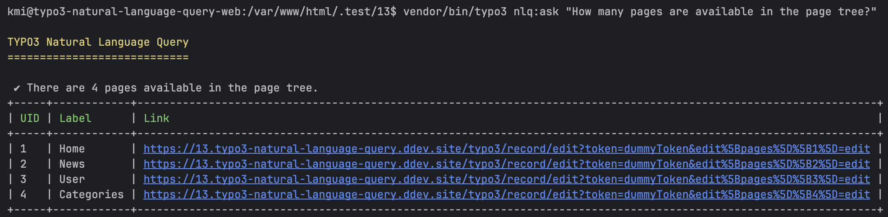
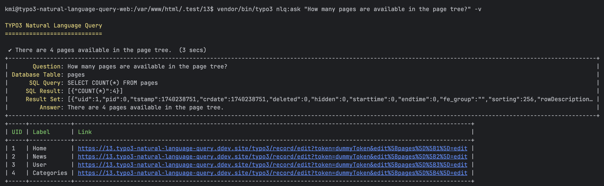

<div align="center">

# TYPO3 extension `typo3_natural_language_query`

</div>

This extension provides a natural language query interface for TYPO3 records.

> [!NOTE]  
> This extension is meant to be a proof of concept for prompt engineering and query building using OpenAI. You should probably not use this in production

## Installation

You can install the package via composer:

```bash
composer require xima/typo3-natural-language-query
```

## Configuration

The following configuration options are available:

### API

- `key`: OpenAI API key. Must be created on https://platform.openai.com/account/api-keys.
- `model`: The model to use for the query. See https://platform.openai.com/docs/models. (Default: `gpt-3.5-turbo-instruct`)

### Database

- `strict_mode`: In strict mode, an exception will be thrown if the query attempts to perform a write or alter operation on the database. (Default: `true`)
- `connection`: The name of the database connection to use. Depending on your needs, you may want to restrict the database user to read-only access. (Default: `Default`)
- `ignore_tables`: A comma separated list of tables (supporting wildcards) to ignore when querying the database. (Default: `sys_*, cache_*, cf_*`)
- `ignore_fields`: A comma separated list of fields to ignore when querying the database. (Default: `password`)

## Console command

Use the console command to ask a natural langauge question for querying records.

```bash
vendor/bin/typo3 nlq:ask "How many pages are available in the page tree?"
```



Use the `-v` verbose option to get more information about the query process.

```bash
vendor/bin/typo3 nlq:ask "How many pages are available in the page tree?" -v
```



## Service

You can also use the `Solver` service to solve natural language queries in your own code.

```php
<?php

use Xima\NaturalLanguageQuery\Service\Solver;

class DemoController {

    public function __construct(Solver $solver) {}
    
    public function demoFunction(string $question) {
        $query = $this->solver->solve($question);
        return $query->answer;
    }
}
```

## Background

This extension uses the OpenAI API to solve natural language queries while build SQL queries to query the TYPO3 database.

This allows users to formulate complex database queries without writing SQL manually.

### Creating the Query Prompt

To generate an SQL query from a natural language input, the extension uses structured prompting. It analyzes the user's request, enriches it with relevant metadata about the TYPO3 database structure, and sends it to the OpenAI API.

```text
Given an input question, first create a syntactically correct {dialect} query for a TYPO3 instance to run, then look at the results of the query and return the answer. Pay attention to the correct syntax of the query. If the answer refers to one or more specific data sets, also provide the individual UIDs.

Use the following format:

Question: "Question here"
DesiredTable: "Table to use"
SQLQuery: "SQL Query to run"
SQLResult: "Result of the SQLQuery"
Answer: "Final answer here (including UIDs if necessary in format UID=1,2,3)"
```

First try to determine the desired table to use for answering the question.

```text
First determine the desired table to use for answering the question.
"backend_layout" (Backend Layout),"be_dashboards" (Dashboard),"be_groups" (Backend usergroup), ...

Question: "How many pages are available in the page tree?"
DesiredTable: "
```

When you have determined the desired table, create a SQL query to answer the question.

```text
Only use the following tables and columns:
"pages" has columns: uid (INT),pid (INT),tstamp (INT),crdate (INT), ...


Question: "How many pages are available in the page tree?"
DesiredTable: "pages"
SQLQuery: "
```

### OpenAI Conversation

The structured query request is sent to the OpenAI API, which generates a corresponding SQL query. Optimized prompt engineering ensures that the generated queries are accurate and aligned with the TYPO3 database schema.

### Querying the Database

Once OpenAI returns an SQL statement, the extension validates and executes it against the TYPO3 database. Strict security mechanisms are in place to prevent unauthorized or destructive operations.

```sql
SELECT COUNT(*) FROM pages;
```

### Getting the Answer

The results of the query are processed and presented in a user-friendly format.

```text
Question: "How many pages are available in the page tree?"
DesiredTable: "pages"
SQLQuery: "SELECT COUNT(*) FROM pages"
SQLResult: "[{"COUNT(*)":4}]"
Answer: "
```

### Error handling

#### Exceeding prompt length

If the prompt exceeds the maximum length of 4096 characters, the extension adjust the prompt to be within the limit.

```text
Try to reduce the sql result in your query while only fetching the necessary uids.
```

#### Invalid SQL query

If the SQL query fails, the extension resend the prompt for querying the sql query adding the sql error from the database.

### Security Considerations

To prevent unauthorized access or data loss, the extension uses strict security measures. It restricts the query capabilities to read-only operations and ignores sensitive tables and fields by default.

## Development

Use the following ddev command to easily install all supported TYPO3 versions for locale development.

```bash
$ ddev install
```

## Credits

This project is highly inspired by the article [Query your Laravel database using natural language](https://beyondco.de/blog/query-your-laravel-database-using-natural-language) by [Marcel Pociot](https://pociot.dev/).

## License

This project is licensed
under [GNU General Public License 2.0 (or later)](LICENSE.md).
